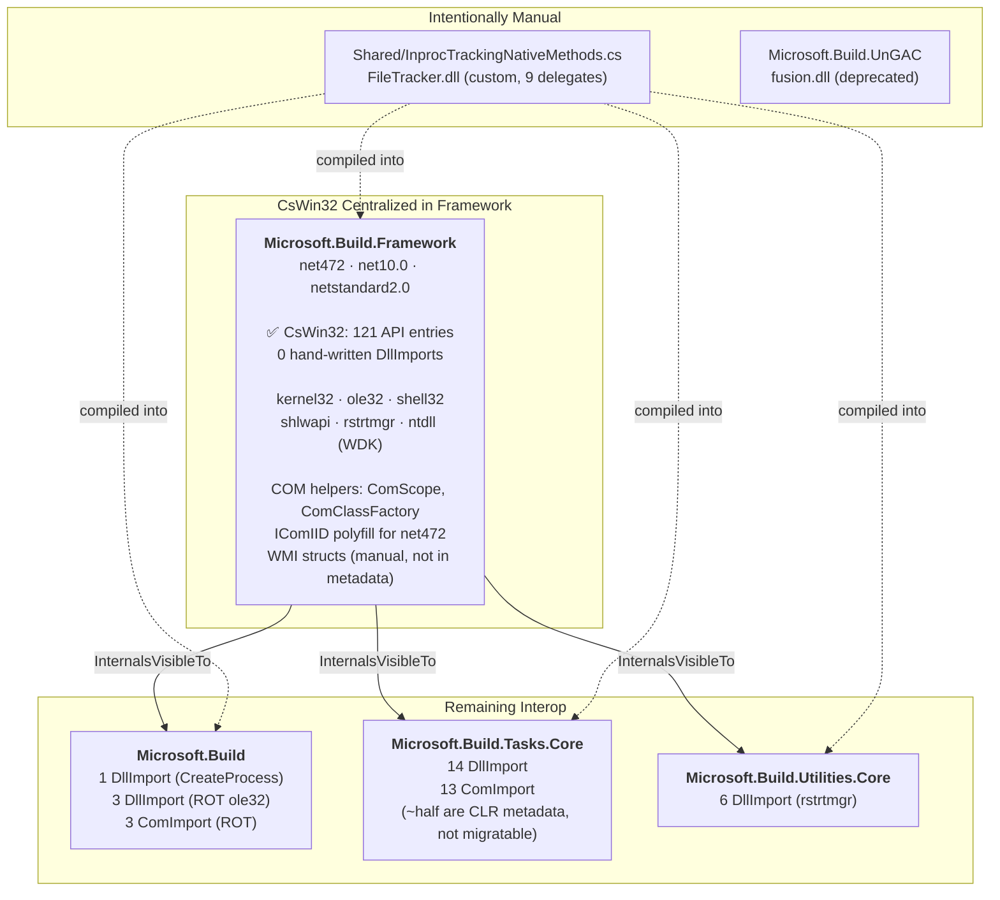

# Plan: Consolidating Win32 Interop via CsWin32

## Current State

### Phase 1 Complete — Framework NativeMethods.cs Migrated

Phase 1 of the CsWin32 migration is complete. All 32 hand-written `[DllImport]` declarations in `Framework/NativeMethods.cs` have been replaced with CsWin32-generated `PInvoke.*` calls, and all hand-written structs and enums replaced by CsWin32-generated types. The WMI COM interfaces in `ProcessExtensions.cs` have been migrated to struct-based COM using the `ComScope<T>` pattern. Compile-time `#if TARGET_WINDOWS` guards replace runtime `if (IsWindows)` checks throughout.

See [CsWin32-Interop-Guide.md](../wiki/CsWin32-Interop-Guide.md) for the conversion patterns and gotchas discovered during Phase 1.

### Interop Inventory

| Project | TFMs | DllImports | ComImports | CsWin32 | Key Files |
|---------|------|-----------|------------|---------|-----------|
| **Microsoft.Build.Framework** | net472, net10.0, netstandard2.0 | 0 (+4 in WindowsNative.cs) | 0 | ✅ **Complete** | `NativeMethods.cs`, `FileSystem/WindowsNative.cs` |
| **Microsoft.Build** | net472, net10.0 | 1 (+3 in ROT) | 3 (ROT) | ⚠️ Partial | `BackEnd/Node/NativeMethods.cs`, `Instance/RunningObjectTable.cs`, `BuildCheck/UntrustedLocationCheck.cs` |
| **Microsoft.Build.Tasks.Core** | net472, net10.0, netstandard2.0 | ~14 | 13 | ❌ None | `NativeMethods.cs`, `Interop.cs`, `ManifestUtil/NativeMethods.cs`, `BootstrapperUtil/NativeMethods.cs` |
| **Microsoft.Build.Utilities.Core** | net472, net10.0, netstandard2.0 | 6 | 0 | ❌ None | `LockCheck.cs` |
| **MSBuild CLI** | net472, net10.0 | 0 | 0 | N/A | Consumes Framework CsWin32 via `InternalsVisibleTo` |
| **Microsoft.Build.UnGAC** | net472 | 1 | 1 | ❌ N/A | `NativeMethods.cs` (fusion.dll — not in Win32 metadata) |

### Infrastructure Already in Place

| Component | Location | Purpose |
|-----------|----------|---------|
| `NativeMethods.txt` | `src/Framework/` | 121 API entries generating kernel32, ole32, shell32, shlwapi, rstrtmgr, ntdll |
| `NativeMethods.json` | `src/Framework/` | `allowMarshaling: false`, `useSafeHandles: false`, `preserveSigMethods: ["*"]` |
| `ComScope<T>` | `src/Shared/Win32/` | COM pointer lifetime management (`ref struct`, `using` pattern) |
| `ComClassFactory` | `src/Shared/Win32/` | AOT-compatible COM activation via `CoGetClassObject` |
| `BSTR` partial | `src/Shared/Win32/` | `IDisposable` + string constructor for CsWin32's `BSTR` |
| `IID.Get<T>()` | `src/Shared/Win32/` | Cross-TFM IID lookup (instance-based on net472, `static abstract` on .NET) |
| `IComIID` (net472) | `src/Framework/Framework/Windows/Win32/` | Instance-based polyfill for CsWin32's `static abstract IComIID` |
| `VARIANT` partial | `src/Framework/Utilities/` | `IDisposable` wrapping `VariantClear` |
| WMI COM structs | `src/Framework/Utilities/Wmi/` | `IWbemLocator`, `IWbemServices`, `IWbemClassObject`, `IEnumWbemClassObject` — manual struct-based (not in Win32 metadata) |
| `TrimmingAttributes` | `src/Shared/` | Polyfill `[RequiresUnreferencedCode]`, `[DynamicallyAccessedMembers]` for net472/netstandard2.0 |
| `PolySharp` | NuGet (net472 only) | Polyfill `CallerArgumentExpression`, `OverloadResolutionPriority` for CsWin32 on net472 |

### Lessons Learned from Phase 1

These are documented in detail in the [CsWin32-Interop-Guide.md](../wiki/CsWin32-Interop-Guide.md):

1. **`#if TARGET_WINDOWS` vs `#if NET && TARGET_WINDOWS`** — `TARGET_WINDOWS` is defined on all TFMs on Windows. Files using `delegate* unmanaged`, `static abstract`, or `ComScope<T>` must use `#if NET && TARGET_WINDOWS` to exclude net472/netstandard2.0.

2. **`#elif` chains for multi-platform branching** — Nested `#if` blocks cause CS0161 on TFMs where no inner branch is active. Use `#elif` chains for three-way Windows / non-Windows .NET / .NET Framework splits.

3. **CA1416 suppression** — The platform compatibility analyzer does not understand `#if TARGET_WINDOWS`. `#pragma warning disable CA1416` is needed inside `#if TARGET_WINDOWS` blocks for callers of `[SupportedOSPlatform]` methods.

4. **IDE0005 treated as error** — Official builds treat all warnings as errors. Moving code behind `#if TARGET_WINDOWS` makes some `using` directives conditionally unnecessary — they must be guarded too.

5. **XML comments before `#if` blocks** — Produce CS1587 on non-Windows. Move comments inside the block.

6. **Windows-only classes** — Entire files (e.g., `WindowsFileSystem.cs`, `MSBuildOnWindowsFileSystem.cs`) must be wrapped in `#if TARGET_WINDOWS` / `#endif`, and factory methods updated to compile-time selection.

---

## Project Dependency Diagram

---

## Remaining Phases

### Phase 2: WindowsNative.cs File Enumeration APIs

**Goal:** Replace the 4 remaining hand-written `[DllImport]` declarations in `Framework/FileSystem/WindowsNative.cs`.

**APIs to migrate:**

| API | DLL | Notes |
|-----|-----|-------|
| `FindFirstFileW` | kernel32 | Already in `NativeMethods.txt` |
| `FindNextFileW` | kernel32 | Already in `NativeMethods.txt` |
| `FindClose` | kernel32 | Already in `NativeMethods.txt` |
| `PathMatchSpecExW` | shlwapi | Already in `NativeMethods.txt` as `PathMatchSpec` |

**Steps:**
1. Replace `[DllImport]` calls with `PInvoke.*` equivalents using CsWin32-generated types.
2. Replace hand-written `Win32FindData` struct with CsWin32's `WIN32_FIND_DATAW`.
3. Update `SafeFindFileHandle` to use `PInvoke.FindClose`.
4. Convert remaining `if (IsWindows)` in file-enumeration code to `#if TARGET_WINDOWS`.
5. Run `Framework.UnitTests`.

**Scope:** ~200 lines changed in one file.

---

### Phase 3: Build Project — Centralize Remaining Interop

**Goal:** Replace the 4 DllImports and 3 ComImport interfaces remaining in `Microsoft.Build`.

| File | Current State | Migration |
|------|--------------|-----------|
| `BackEnd/Node/NativeMethods.cs` | 1 `CreateProcess` DllImport + 3 structs | Already in `NativeMethods.txt`. Replace structs with CsWin32 types (`STARTUPINFOW`, `PROCESS_INFORMATION`, `SECURITY_ATTRIBUTES`). Delete file. |
| `BuildCheck/UntrustedLocationCheck.cs` | 1 `SHGetKnownFolderPath` DllImport | Already in `NativeMethods.txt`. Replace inline class with `PInvoke.SHGetKnownFolderPath`. |
| `Instance/RunningObjectTable.cs` | 3 DllImports + 3 ComImport interfaces | `CreateItemMoniker`, `GetRunningObjectTable`, `GetErrorInfo` already in `NativeMethods.txt`. Refactor `IRunningObjectTable`, `IMoniker` to struct-based COM with `ComScope<T>`. |

**Steps:**
1. Replace `BackEnd/Node/NativeMethods.cs` structs and delete the file. Update `NodeLauncher.cs` to use CsWin32 types directly.
2. Inline `PInvoke.SHGetKnownFolderPath` in `UntrustedLocationCheck.cs`.
3. Migrate `RunningObjectTable.cs` to struct-based COM (requires partial implementations for `IRunningObjectTable`, `IMoniker`).
4. Run `Build.UnitTests`.

---

### Phase 4: Utilities — Restart Manager APIs

**Goal:** Replace the 6 `[DllImport]` declarations and 4 hand-written structs in `LockCheck.cs`.

**APIs:** `RmStartSession`, `RmEndSession`, `RmRegisterResources`, `RmGetList` — all already in `NativeMethods.txt`.

**Steps:**
1. Replace DllImports with `PInvoke.*` calls.
2. Replace hand-written `RM_UNIQUE_PROCESS`, `RM_PROCESS_INFO`, `FILETIME` with CsWin32 types.
3. Remove hand-written enums (`RM_APP_TYPE`, `RM_APP_STATUS`, `RM_REBOOT_REASON`).
4. Run `Utilities.UnitTests`.

**Scope:** ~150 lines changed in one file.

---

### Phase 5: Tasks — Partial Migration

**Goal:** Replace CsWin32-replaceable APIs only. CLR metadata interfaces stay manual.

#### Migratable (14 DllImports + 3 ComImports)

| File | APIs | Action |
|------|------|--------|
| `BootstrapperUtil/NativeMethods.cs` | `BeginUpdateResourceW`, `UpdateResourceW`, `EndUpdateResource` | All in `NativeMethods.txt`. Replace and delete file. |
| `ManifestUtil/NativeMethods.cs` | `LoadLibraryExW`, `SetDllDirectoryW`, `FreeLibrary`, `FindResource`, `LoadResource`, `SizeofResource`, `LockResource`, `EnumResourceNames`, `LoadTypeLibEx` | All in `NativeMethods.txt`. Remove migratable declarations; keep `SfcIsFileProtected` and `GetAssemblyIdentityFromFile`. |
| `Interop.cs` | `IInternetSecurityManager`, `IInternetSecurityMgrSite`, `IEnumString` | Migrate to struct-based COM with `ComScope<T>`. |
| `ComReference.cs` | Already uses `PInvoke.LoadLibrary`, `PInvoke.FreeLibrary`, `PInvoke.GetModuleFileName` | ✅ Already migrated — no further action. |

#### Not Migratable (10 ComImports — CLR metadata)

These interfaces are not in Win32 metadata and cannot be generated by CsWin32:

- `IMetaDataDispenser`, `IMetaDataImport`, `IMetaDataImport2`, `IMetaDataAssemblyImport` — CLR metadata APIs
- `IAssemblyName`, `IAssemblyEnum`, `IAssemblyCache` — fusion.dll GAC APIs
- `ICreateTypeLib`, `IFixedTypeInfo` — COM type library APIs
- `IClassFactory` — Used for COM activation of CLR metadata types

**Steps:**
1. Delete `BootstrapperUtil/NativeMethods.cs` (fully replaced).
2. Strip migratable declarations from `ManifestUtil/NativeMethods.cs`.
3. Refactor `Interop.cs` COM interfaces to struct-based with `ComScope<T>`.
4. Annotate remaining CLR metadata interfaces with `// Not in Windows metadata, cannot use CsWin32`.
5. Run `Tasks.UnitTests`.

---

### Phase 6 (Optional): Shared Code & UnGAC

**`InprocTrackingNativeMethods.cs`** — Uses manual `GetProcAddress` → delegate loading for `FileTracker.dll`. This is a custom MSBuild unmanaged DLL not in Win32 metadata. It has its own private `[DllImport]` for `LoadLibrary`/`GetProcAddress` since it's compiled into multiple assemblies via the Shared-code pattern. **Leave as-is.**

**`Microsoft.Build.UnGAC`** — Uses `fusion.dll` (GAC APIs, not in Win32 metadata). Packaging tool, net472-only, deprecated APIs. **Leave as-is.**

---

## Target Architecture

After all phases, the interop landscape collapses to:

| Category | Phase 1 (now) | All phases complete |
|----------|---------------|---------------------|
| CsWin32-generated APIs | **121** (Framework only) | **121** (same — already comprehensive) |
| Hand-written DllImports in Framework | **0** (+4 in WindowsNative.cs) | **0** |
| Hand-written DllImports across all projects | **29** | **~4** (CLR metadata + FileTracker private) |
| Hand-written ComImport | **16** across 2 projects | **~10** (CLR metadata only, in Tasks) |
| Projects with hand-written interop | **4** | **2** (Tasks for CLR-only, Shared for FileTracker) |

---

## Risk Assessment

| Risk | Likelihood | Impact | Mitigation |
|------|-----------|--------|------------|
| CA1416 false positives inside `#if TARGET_WINDOWS` | High | Low | `#pragma warning disable CA1416` inside the `#if` block. Verified in Phase 1. |
| `#elif` vs nested `#if` causing CS0161 | High | Medium | Use `#elif` chains for multi-platform branching. Documented in guide. |
| IDE0005 on conditionally-needed `using` directives | High | Low | Guard `using` with matching `#if`. Verified in Phase 1. |
| COM `ComScope<T>` migration changes error semantics | Medium | Medium | `preserveSigMethods: ["*"]` returns HRESULT; callers check explicitly. Verified with WMI migration. |
| PolySharp / CsWin32 type conflicts on net472 | Low | Medium | `PolySharpExcludeGeneratedTypes` excludes duplicates. Verified in Phase 1. |
| Source-build breaks on non-Windows | Medium | High | CsWin32 reference conditioned on `$(TargetOS) == 'windows'`. Non-Windows build verified. |

---

## Reference

- [CsWin32 Interop Conversion Guide](../wiki/CsWin32-Interop-Guide.md) — Patterns, gotchas, and rules for the migration
- [CsWin32 COM Interop Migration Guide](../wiki/CsWin32-COM-Interop-Migration.md) — `ComScope<T>`, `ComClassFactory`, `IComIID` bridge patterns
- [dotnet/sdk PR #52813](https://github.com/dotnet/sdk/pull/52813) — Full CsWin32 migration reference implementation
- [dotnet/sdk PR #53627](https://github.com/dotnet/sdk/pull/53627) — `TargetOS`/`TARGET_WINDOWS` infrastructure
- [JeremyKuhne/madowaku](https://github.com/JeremyKuhne/madowaku) — CsWin32 multi-TFM (net10.0 + net472) with Framework/ polyfills
